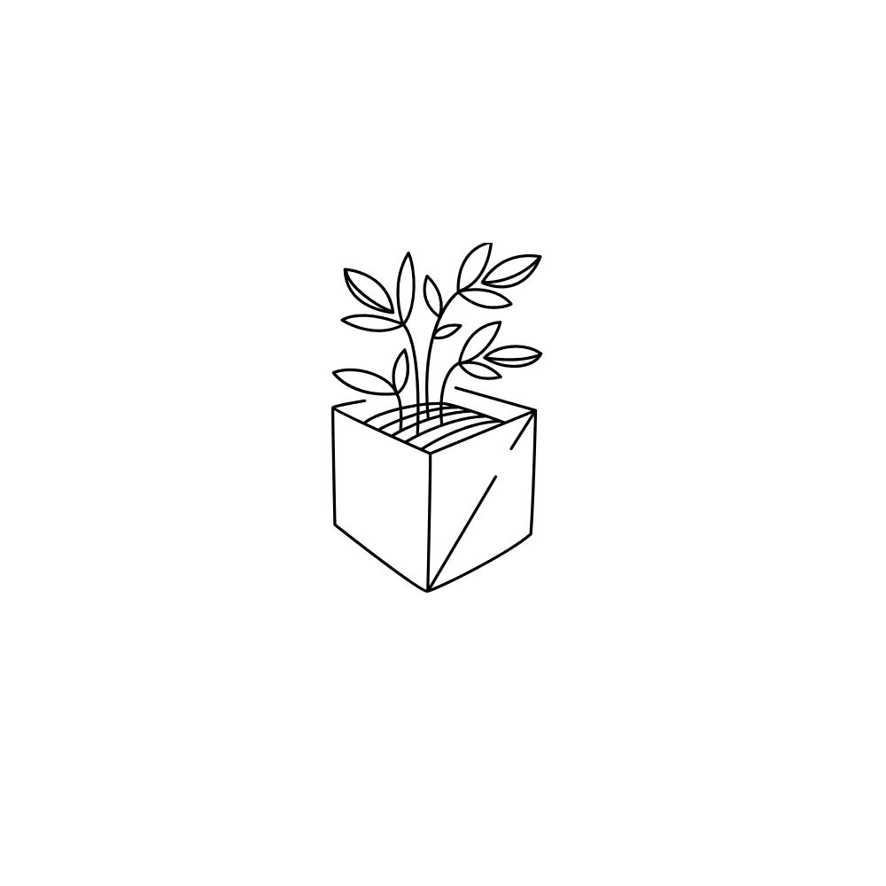

<h2 align="center">AgroPi</h2>  
<p align="center">
  <a href="https://github.com/krogk/AgroPi">
    
  </a>
  
  <p align="center">
    Learn about cultivation of plants or fungus through a Raspberry Pi enabled environment monitor & regulator. 
    <br />
</div>

<p align="center">
  <a href="https://github.com/krogk/AgroPi">
    
    
    
  </a>


<!-- TOC -->
<details open="open">
  <summary><h2 style="display: inline-block">Contents</h2></summary>
  <ol>
    <li>
      <a href="#about">About</a>
      <ul>
        <li><a href="#software">Software</a></li>
        <li><a href="#hardware">Hardware</a></li>
        <li><a href="#roadmap">Roadmap</a></li>
      </ul>
    </li>
    <li>
      <a href="#getting-started">Getting Started</a>
      <ul>
        <li><a href="#prerequisites">Prerequisites</a></li>
        <li><a href="#installation">Installation</a></li>
        <li><a href="#usage">Usage</a></li>
      </ul>
    </li>
    <li><a href="#contributing">Contributing</a></li>
    <li><a href="#license">License</a></li>
    <li><a href="#contact">Contact</a></li>
    <li><a href="#wiki">Wiki</a></li>
  </ol>
</details>

<!-- Project descirption -->
## About

AgroPi is an low cost educational tool which allows user to 
<br />
AgroPi uses a website interface which allows user display and control the conditions within your enviromental chamber in real time.
<br />
The information throughout your grow cycle is saved so you can share it with other users, which can copy the exact conditions you specifed within a click of a button. 


### Software

Website Interface
<br />
Spoilage Recognition
<br />


### Hardware

* [Raspberry Pi 4 Model B](https://www.raspberrypi.org/products/raspberry-pi-4-model-b/)
<br />

Sensors:
* [Camera]()
* [Thermometer]()
* [Humidity Sensor]()

<br />

Actuators:
* [Water Pump]()
* [Relay Board]()

<br />

Schematics:
* [Schematic]()


### Roadmap

[x] Github Setup
<br />
[] Website up & running
<br />

<!-- Getting Started -->
## Getting Started

### Prerequisites

Ubuntu Packages 
* cmake
  ```sh
  sudo apt-get install cmake
  ```

### Installation

1. Clone the repository
   ```sh
   git clone https://github.com/krogk/AgroPi
   ```
2. Run auto configuration script
   ```sh
   ./autoconf
   ```
3. Compile
    ```sh
   make 
   ```
4. Flashing
    ```sh
   upload -p /dev/ttyUSB0 --fqbn rpi4:rpi4:AgroPi
   ```


<!-- Usage -->
### Usage

To run the software:
  ```sh
 nohup agropistart.sh &
 ```

To stop software:
  ```sh
 agropistop.sh
 ```

<!-- Contributing -->
## Contributing

1. Fork this repo
<br />
<div align="center">
  
[](https://github.com/krogk/AgroPi/graphs/contributors)
[](https://github.com/krogk/AgroPi/network/members)
[](https://github.com/krogk/AgroPi/stargazers)
[](https://github.com/krogk/AgroPi/issues)
[](https://github.com/krogk/AgroPi/blob/main/LICENSE)

</div>

<!-- License -->
## License

Distributed under the GPL-3.0 License. See `LICENSE` for more information.


<!-- Contact Info -->
## Contact


[Samuel Obosu](https://github.com/Samuel-Obosu)
<br />
[Andrew Scott-George](https://github.com/andrewsg3)
<br />
[Kamil Rog](https://github.com/krogk)


<!-- AgroPi Wiki -->
## Wiki

[Wiki]()
