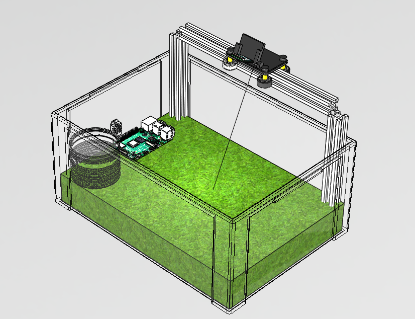
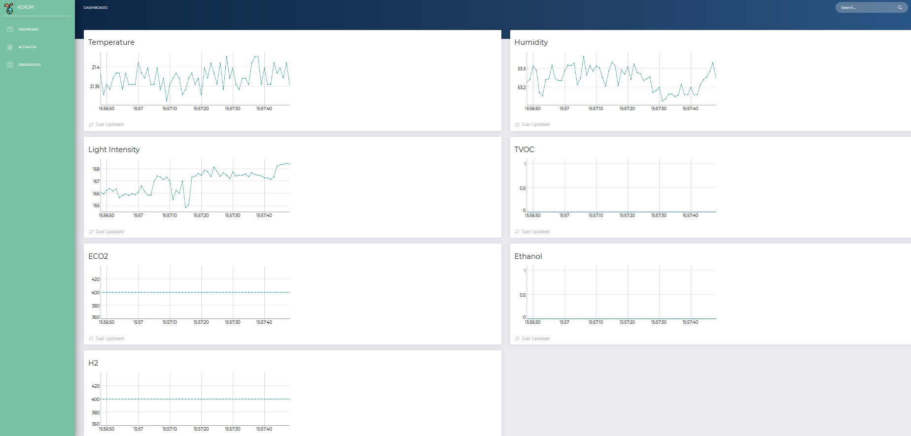
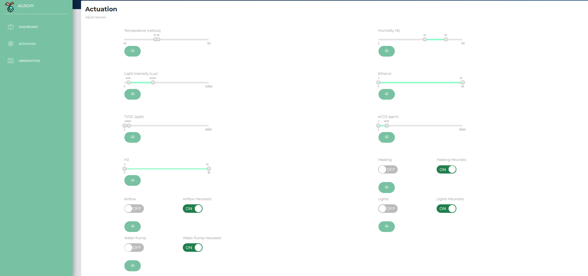

<h2 align="center">AgroPi</h2>  
<p align="center">
  <a href="https://github.com/krogk/AgroPi">
    
  </a>
  
  <p align="center">
    Learn cultivation of plants and mushrooms through a Raspberry Pi driven monitoring system. 
    <br />
</div>

<p align="center">
  <a href="https://twitter.com/AgropiOfficial_">
    
  </a>
  <a href="https://github.com/krogk/AgroPi">
    
  </a>
  <a href="https://www.instagram.com/agropiofficial/">
    
  </a>
  <a href="https://www.facebook.com/AgroPiOfficial">
    
  </a>


<!-- TOC -->
<details open="open">
  <summary><h2 style="display: inline-block">Contents</h2></summary>
  <ol>
    <li>
      <a href="#about">About</a>
      <ul>
        <li><a href="#software">Software</a></li>
        <li><a href="#hardware">Hardware</a></li>
        <li><a href="#roadmap">Roadmap</a></li>
      </ul>
    </li>
    <li>
      <a href="#getting-started">Getting Started</a>
      <ul>
        <li><a href="#prerequisites">Prerequisites</a></li>
        <li><a href="#installation">Installation</a></li>
        <li><a href="#usage">Usage</a></li>
      </ul>
    </li>
    <li><a href="#contributing">Contributing</a></li>
    <li><a href="#license">License</a></li>
    <li><a href="#contact">Contact</a></li>
  </ol>
</details>

<!-- Project descirption -->
## About

AgroPi is a flexible modular educational tool which allows user to learn how changes in enviroment effect plant's/mushroom's health. It is up to the user to decide what actuators fit the enviromental chamber needs best.   
<br />
<br />
Website interface enables user to easily display and control the conditions within enviromental chamber in real time. 
The information throughout your grow cycle is saved in a grow log which you can share with other users so they can copy the exact conditions you've specifed with a click of a button. In addition AgroPi takes photos of your growth in constant intervals so you can show off your crops. 
<br />
<br />
In the near future AgroPi is going to utilize AI driven image pocessing to determine whether your plants are heatlhy and if not specify what might be the issue. Future updates will focus on recognizing stages of growth and nutrient defficiencies. 

<div align="center">

[](https://github.com/krogk/AgroPi/graphs/contributors)
[](https://github.com/krogk/AgroPi/network/members)
[](https://github.com/krogk/AgroPi/stargazers)
[](https://github.com/krogk/AgroPi/issues)
[](https://github.com/krogk/AgroPi/blob/main/LICENSE)

<br />

  <!--  <a href="https://github.com/krogk/AgroPi"> -->
  <!--  --> 
  </a>


</div>

### Software

v0.2 Release allows you to view the following conditions on the website interface:
* Temperature 
* Humidity
* Light Intensity
* [TVOC](https://en.wikipedia.org/wiki/Volatile_organic_compound)
* eCO2
* Ethanol
* Hydrogen
<br />

<p align="center">
  <a href="https://github.com/krogk/AgroPi">
    
  </a>
  
  <p align="center">
    Dashboard 
    <br />
</div>


As well as easily set the target values for your environmental chamber.


<p align="center">
  <a href="https://github.com/krogk/AgroPi">
    
  </a>
  
  <p align="center">
    Control Panel 
    <br />
</div>

Camera allows for detecting seedlings 

[See Doxygen Documentation](https://krogk.github.io/AgroPi/software/docs/Doxygen/html/index.html)
<br />
<br />


### Hardware

* [Raspberry Pi 4 Model B](https://www.raspberrypi.org/products/raspberry-pi-4-model-b/)
<br />

Sensors:
* [Raspberry Pi Camera Rev 1.3 Lens: P5V04A, Cable: AWM 20624]()
* [Thermometer + Humidity - SHT31D](https://github.com/krogk/AgroPi/blob/main/hardware/SHT31D/Sensirion_Humidity_SHT3x_Datasheet_digital-767294.pdf)
* [Light - VEML7700](https://github.com/krogk/AgroPi/blob/main/hardware/VEML7700/veml7700.pdf)
* [Gas - SGP30](https://github.com/krogk/AgroPi/blob/main/hardware/SGP30/SGP30%20Datasheet.pdf)


<br />

Actuators - This is your choice as AgroPi is designed to control relay by changing state of the GPIO pins(make sure your relay module is compatible with 3v3 logic). For our demo the following are used:

Switching Technology:
* [Relay Board - Elego ](https://github.com/krogk/AgroPi/blob/Software_Release_1/hardware/Relay%20Board/4%20CHANNEL%205V%2010A%20RELAY%20MODULE.pdf)

Actuators:
* [Heating Element - Zerodis PTC Heating Element AC/DC 12V (80 ℃ 2—5W) ](https://www.amazon.co.uk/gp/product/B07FJZQLMK/ref=ppx_yo_dt_b_asin_title_o00_s00?ie=UTF8&psc=1)
* [Water Pump](https://www.mybotic.com.my/products/Micro-Submersible-Water-Pump-DC-3V-5V/2778#:~:text=Suction%20Distance%3A%200.8%20meter%20)
* [Fan - Coolermaster A12025-12CB-3BN-F1]()


Schematics:
* [System Schematic](https://github.com/krogk/AgroPi/blob/Software_Release_1/hardware/Schematic.svg)


<p align="center">
  <a href="https://github.com/krogk/AgroPi">
    
  </a>
  
  <p align="center">
    Example Setup
    <br />
</div>


### Roadmap

[x] Next Software Release (v0.2) - Actuation & Image Processing - Detecting Seedling/Mushroom - 20/04/2021
* [x] Camera Integrated
* [x] Relay Board Driver
* [x] Relay Board Integration
* [x] Web-Server Improvments
* [x] Gather Training Dataset
* [x] Train neuralnet
* [x] Test on real samples

[] Software Release 3 Planning scheduled for september 2021(v0.3)

<!-- Getting Started -->
## Getting Started

### Prerequisites
1. Clone the repository
```sh
git clone https://github.com/krogk/AgroPi
```
2. Ubuntu Packages: 
```sh
./install.sh
```
3. Server Depencencies: 
```sh
pip install -r requirements.txt
```

### Installation

Build:
```sh
mkdir build
cd build/
cmake ..
make test ARGS="-V"  <- Optional Test Run, All sensors must be connected
make
```

<!-- Usage -->
### Usage

To run the software:

1. Go to web directory and run server
```sh
python ./run.py &
```

2. Go to build directory and run application
```sh
./src/AgroPi 
```

3. Wait 15 Seconds for application to set up sensors.

4. Connect to webiste in your browser on your phone or pc
```sh
 (Rpi ip adress):80
```
Switch to control pannel, update your target values and enable your actucation heuristics. 


<!-- Contributing -->
## Contributing

See `CONTRIBUTING` for more information.

<!-- License -->
## License

Distributed under the GPL-3.0 License. See `LICENSE` for more information.


<!-- Contact Info -->
## Contact

[Samuel Obosu - Web server & Network Programming](https://github.com/Samuel-Obosu)
<br />
[Andrew Scott-George - Image Processing](https://github.com/andrewsg3)
<br />
[Kamil Rog - C++ Real-time Embedded Programming](https://github.com/krogk)
